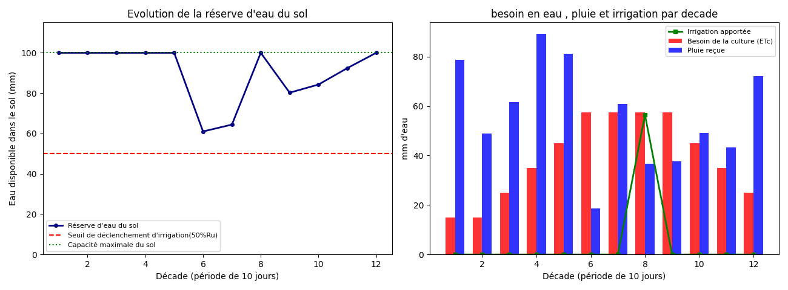
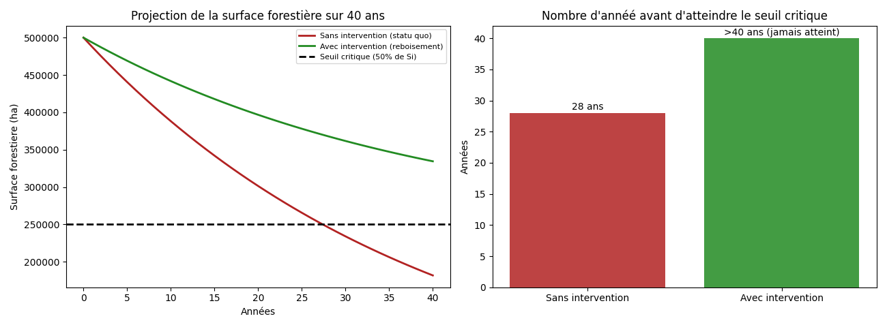
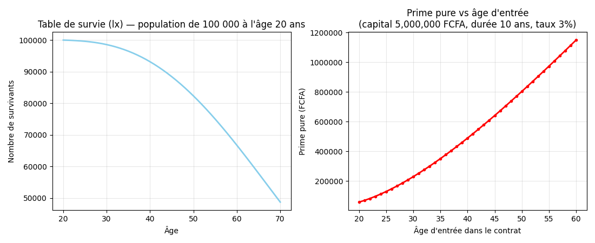

# Portfolio Python — Abdoulaye Zoukou Féïchal

Projets Python réalisés pour consolider mes compétences en mathématiques appliquées et en data science, à travers la modélisation de problèmes concrets en agriculture, environnement et actuariat.

Chaque projet part d'un problème réel, s'appuie uniquement sur **NumPy** et **Matplotlib**, et est documenté étape par étape (contexte, méthode, code, interprétation).

---

## 🌾 1. Agriculture — Bilan hydrique et calendrier d'irrigation

**Fichier :** [`Agriculture.py`](./Agriculture.py)

Modélisation du bilan hydrique d'une culture (modèle du réservoir sol-plante) à partir du coefficient cultural (Kc) et de la pluviométrie simulée, pour déterminer les périodes de déficit et les besoins d'irrigation d'une saison.

---

## 🌳 2. Environnement — Projection de la déforestation

**Fichier :** [`Environnement.py`](./Environnement.py)

Projection sur 40 ans de l'évolution d'une surface forestière selon un modèle de décroissance exponentielle, comparant un scénario "statu quo" à un scénario intégrant un programme de reboisement.

---

## 📊 3. Actuariat — Simulateur de prime d'assurance-vie

**Fichier :** [`Actuariat.py`](./Actuariat.py)

Construction d'une table de mortalité et d'une table de survie, puis calcul de la prime pure d'une assurance-vie temporaire par actualisation, selon l'âge d'entrée, la durée du contrat et le capital assuré.

---

## Outils utilisés

- **Python** — NumPy, Matplotlib
- Aucune bibliothèque avancée (pas de pandas, scipy) — chaque calcul est implémenté directement pour bien en comprendre la mécanique.

## Démarche

Les deux premiers projets (agriculture, environnement) explorent des problématiques générales de gestion des risques, dans la continuité de mon parcours en mathématiques. Le troisième (actuariat) marque ma décision de me spécialiser dans ce domaine, en consolidant mes bases théoriques par une application concrète.
